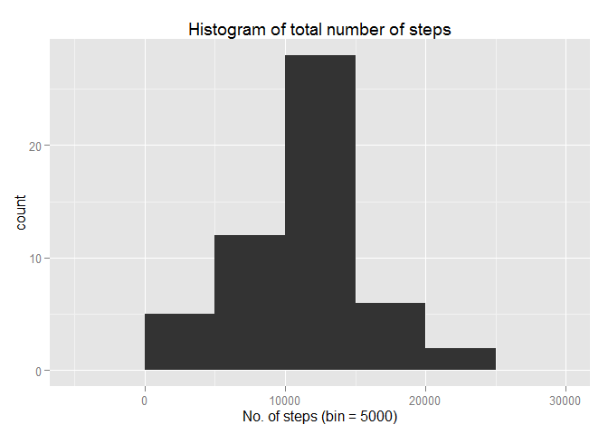
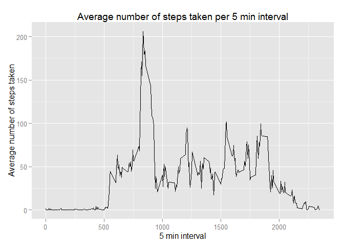
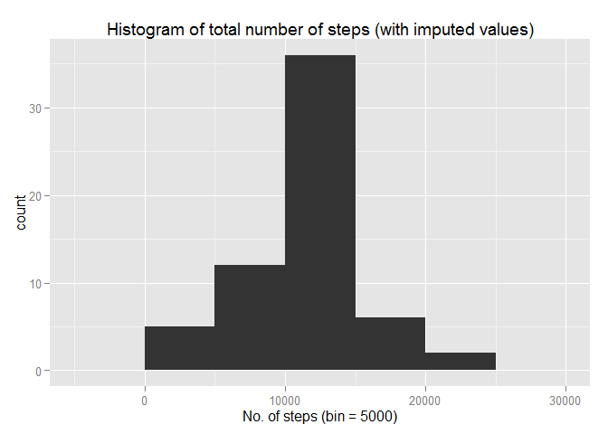

# Reproducible Research: Peer Assessment 1

This report is for the Coursera 'Reproducible Research: Peer Assessment 1' assignment.

## Loading and preprocessing the data

```r
setwd("C:\\Users\\rob.harrand\\Desktop\\GitHub\\New folder\\RepData_PeerAssessment1") #Set the working directory
data = read.csv(unz("activity.zip", "activity.csv"), header = TRUE, na.strings = "NA") #Read in the data
data$date = as.POSIXct(data$date) #Change the date format
```

## What is mean total number of steps taken per day?


```r
totals = aggregate(steps~date, data = data, sum, na.rm = TRUE) #Calculate values for histogram
```

The total number of steps taken each day can be seen in the histogram below,


```r
library(ggplot2) #Load ggplot2 for the histograms
```


```r
qplot(totals$steps, main = "Histogram of total number of steps", xlab = "No. of steps (bin = 5000)", bin = 5000) #Plot the histogram
```

 


```r
mean1 = round(mean(totals$steps), digits = 2) #Calculate mean
median1 = round(median(totals$steps), digits = 2) #Calculate median
```

The mean for the total number of steps taken each day is 1.076619\times 10^{4} and the median is 1.0765\times 10^{4}


## What is the average daily activity pattern?


```r
averages = aggregate(steps ~ interval, data = data, mean, na.rm = TRUE) #Calculate averages
```

The average number of steps taken per 5 min interval can be seen below,


```r
qplot(interval, steps, data = averages, geom = "line", ylab = "Average number of steps taken", xlab = "5 min interval",
main = "Average number of steps taken per 5 min interval") #Plot the graph
```

 


```r
av = averages$interval[averages$steps == max(averages$steps)] #Work out which interval has the maximum number
```

The interval that contains the maximum number of steps is interval 835


## Imputing missing values


```r
nas = sum(is.na(data$steps)) #Work out the total of missing NAs
```

The total number of missing values is 2304

The missing values will be imputed by using the averages for the intervals,


```r
data_imputed = data #Create a copy of the dataset

#Create a for loop to populate the values,
for (i in 1:length(data_imputed$steps)) {
    if(is.na(data_imputed[i,"steps"])) {
        data_imputed[i, "steps"] = averages[averages$interval == data_imputed[i, "interval"], "steps"]
        }
    }
```

The total number of steps taken each day (with imputed values) can be seen in the histogram below. Note the imputed values are interval averages,


```r
totals_imputed = aggregate(steps~date, data = data_imputed, sum) #Calculate values for histogram
```


```r
qplot(totals_imputed$steps, main = "Histogram of total number of steps (with imputed values)", xlab = "No. of steps (bin = 5000)", bin = 5000) #Plot the histogram
```

 


```r
mean2 = round(mean(totals_imputed$steps), digits = 2) #Calculate mean (with imputed values)
median2 = round(median(totals_imputed$steps), digits = 2) #Calculate median (with imputed values)
mean_diff = mean1 - mean2 #Work out the difference in means
median_diff = median1 - median2 #Work out the difference in medians
```

The mean is 1.076619\times 10^{4}  
The median is 1.076619\times 10^{4}  
The mean has changed by the following amount: 0  
The median has changed by the following amount: -1.19

## Are there differences in activity patterns between weekdays and weekends?


```r
#Set the days accordingly,
data_imputed$Day = weekdays(data_imputed$date)
data_imputed$Day_type[data_imputed$Day == 'Monday'] = 'weekday'
data_imputed$Day_type[data_imputed$Day == 'Tuesday'] = 'weekday'
data_imputed$Day_type[data_imputed$Day == 'Wednesday'] = 'weekday'
data_imputed$Day_type[data_imputed$Day == 'Thursday'] = 'weekday'
data_imputed$Day_type[data_imputed$Day == 'Friday'] = 'weekday'
data_imputed$Day_type[data_imputed$Day == 'Saturday'] = 'weekend'
data_imputed$Day_type[data_imputed$Day == 'Sunday'] = 'weekend'
average_steps = aggregate(steps ~ Day_type + interval, data = data_imputed, mean)
```

The differences in activity between weekdays and weekends can be seen below,


```r
qplot(interval, steps, data = average_steps, facets = Day_type ~., geom = "line") #Plot the graph
```

 


